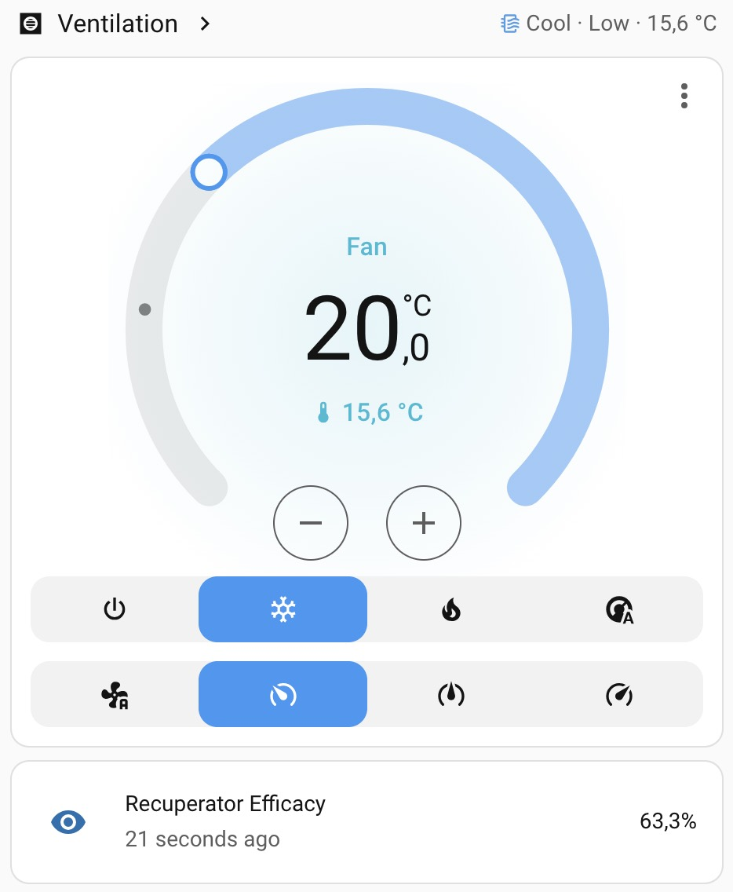
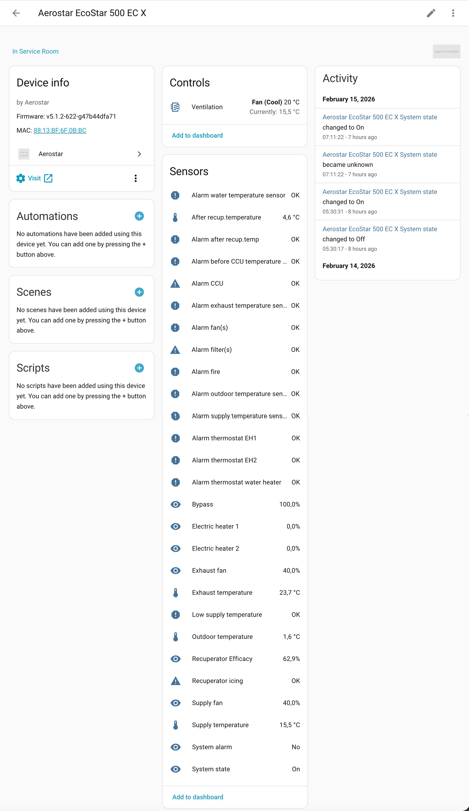

# Aerostar HACS Component

[](https://my.home-assistant.io/redirect/hacs_repository/?owner=BR0kEN-&repository=ha-aerostar&category=integration)

## Recuperator Efficacy Sensor

- State class: `Measurement`
- Unit of measurement: `%`
- Device: `select yours`

```yaml






  unknown

  
  
    unknown
  
    {{ [0, [((supply - outside) | abs / denom * 100), 100] | min] | max | round(1) }}
  

```

## Screenshots



