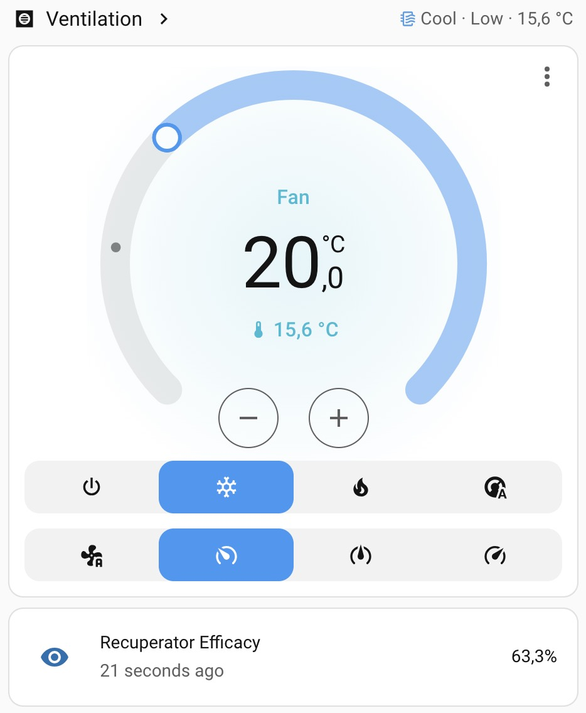
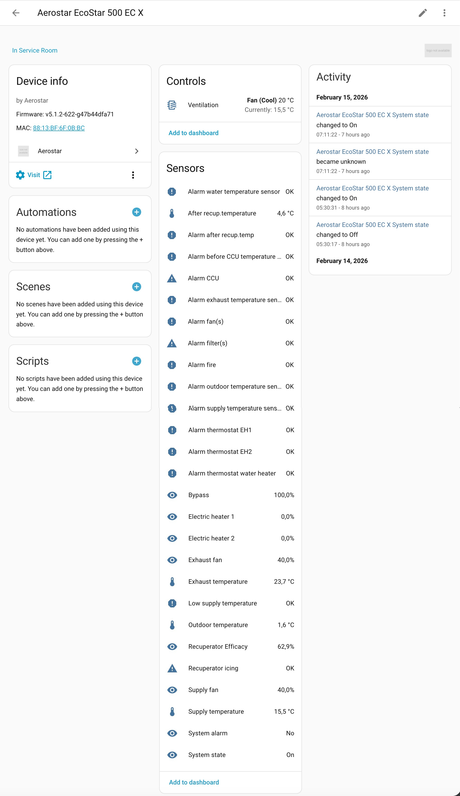

# Aerostar HACS Component

## Recuperator Efficiency Sensors

Temperature efficiency of the recuperator (EN 308), in `%`:

- **Recuperator efficiency** (supply side): `(supply − outdoor) / (exhaust − outdoor)`.
- **Recuperator exhaust efficiency** (exhaust side, diagnostic): `(exhaust − after recup) / (exhaust − outdoor)`.

Both are equal for balanced airflows without heat losses. Their ratio (supply / exhaust) approximates the exhaust-to-supply airflow ratio.

The value is `unknown` when it can't be trusted:

- the extract-to-outdoor temperature difference is below 5 K;
- the system state isn't `On` (off, louvers, defrost, etc.);
- the electric heater 1 (both sensors) or 2 (supply side only) is on;
- the recuperator anti-icing is active.

The sensor is `unavailable` when any of the temperatures it relies on is unavailable.

The sensor attributes explain all of the above, and `unknown_reason` tells why the value is `unknown` right now.

### Migrating from the template sensor

Delete the template helper. To keep its history, rename the new entity's ID to the one of the deleted helper.

## Screenshots

